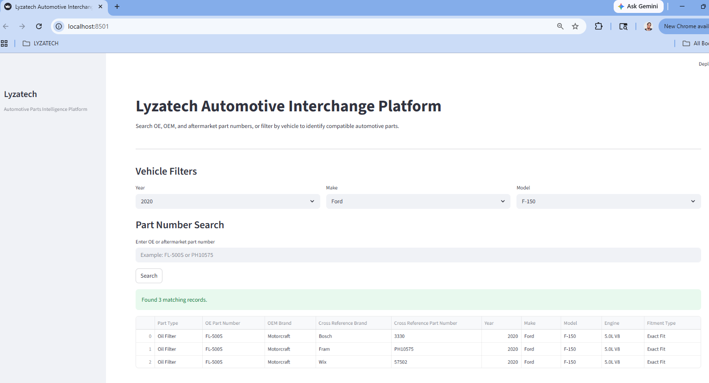

# Automotive Part Interchange Database

A prototype automotive part interchange system built with Python, SQLite, Pandas, and Streamlit.

This application demonstrates how OE, OEM, and aftermarket automotive parts can be cross-referenced across multiple vehicle applications using relational database design and search functionality.

---

## Live Demo

https://automotive-part-interchange-database-3lhu5vjsxtvb8kvrth72ba.streamlit.app/

---

## GitHub Repository

https://github.com/3r1nC/automotive-part-interchange-database

---

## Project Overview

The Automotive Part Interchange Database allows users to:

- Search by OE part number
- Search by aftermarket part number
- Filter by vehicle year, make, and model
- View compatible vehicle fitment
- Cross-reference equivalent aftermarket brands
- Demonstrate automotive interchange database architecture

The project was designed as a scalable prototype that could later evolve into:

- Inventory management systems
- Automotive catalog platforms
- Supplier lookup tools
- Internal dealership tooling
- SaaS interchange platforms
- API-driven fitment services

---

## Features

### Vehicle Fitment Search
Search compatible vehicles using:
- Year
- Make
- Model

### Part Number Search
Search:
- OE part numbers
- OEM part numbers
- Aftermarket interchange numbers

### Relational Database Design
The system uses normalized relational tables:
- vehicles
- parts
- fitment
- cross_references

### Dynamic Filtering
Dropdowns dynamically filter available:
- Makes
- Models

based on vehicle selections.

### Streamlit Web Interface
Interactive web UI built with Streamlit.

---

## Application Preview

### Search Results



---

## Tech Stack

| Technology | Purpose |
|---|---|
| Python | Application logic |
| SQLite | Relational database |
| Pandas | Data import and querying |
| Streamlit | Web application UI |
| Git/GitHub | Version control |
| CSV | Sample data storage |

---

## Project Structure

```text
automotive-part-interchange-database/
│
├── assets/
├── data/
├── database/
├── docs/
├── src/
├── tests/
├── README.md
└── requirements.txt